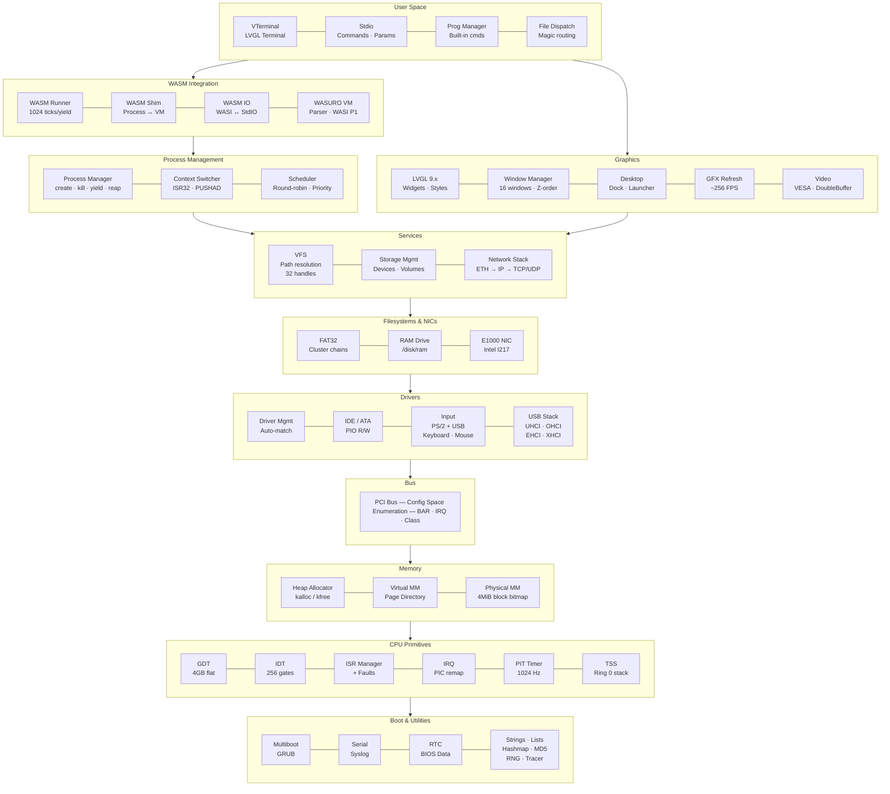
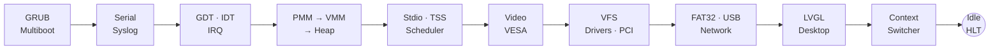
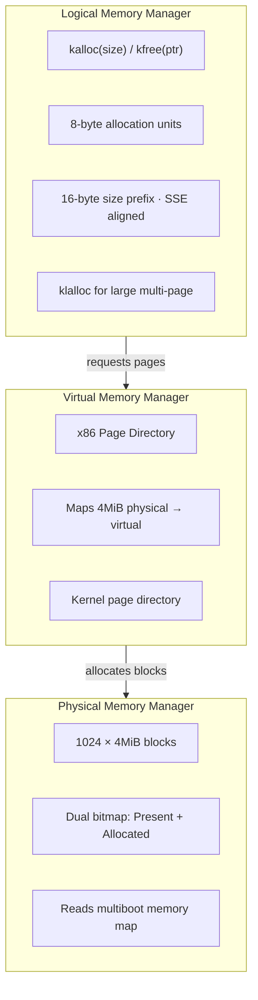
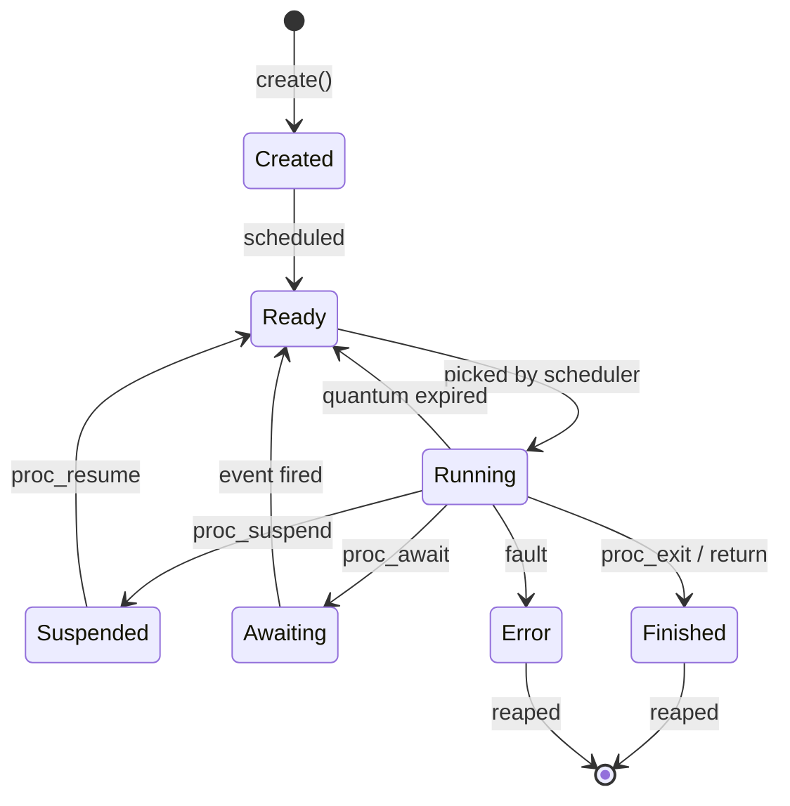
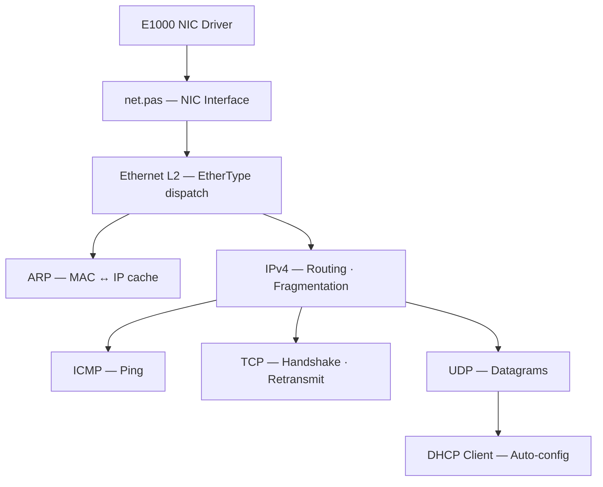
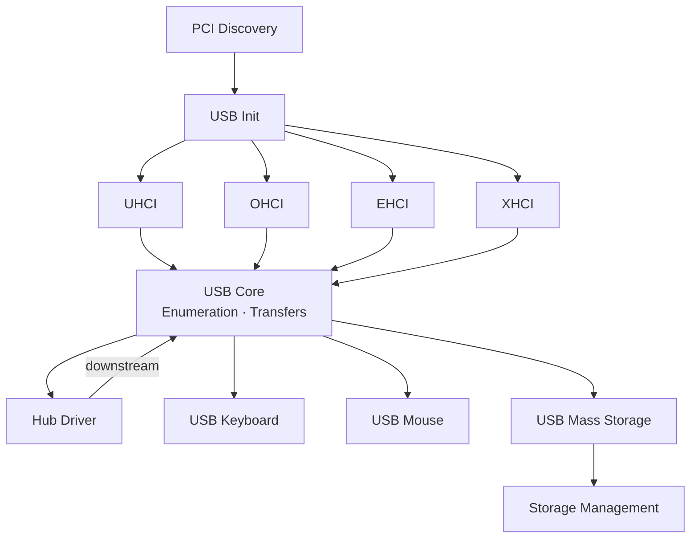
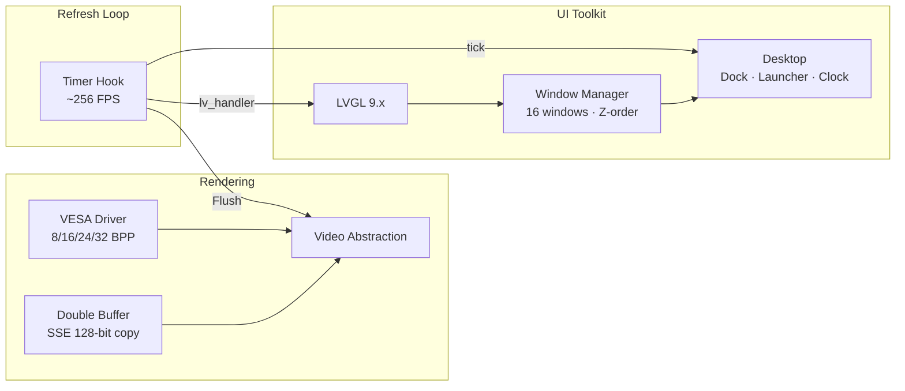
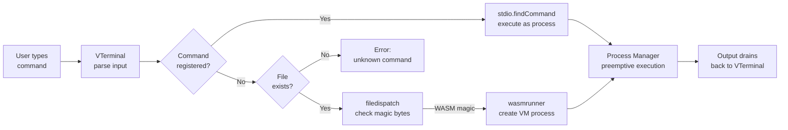
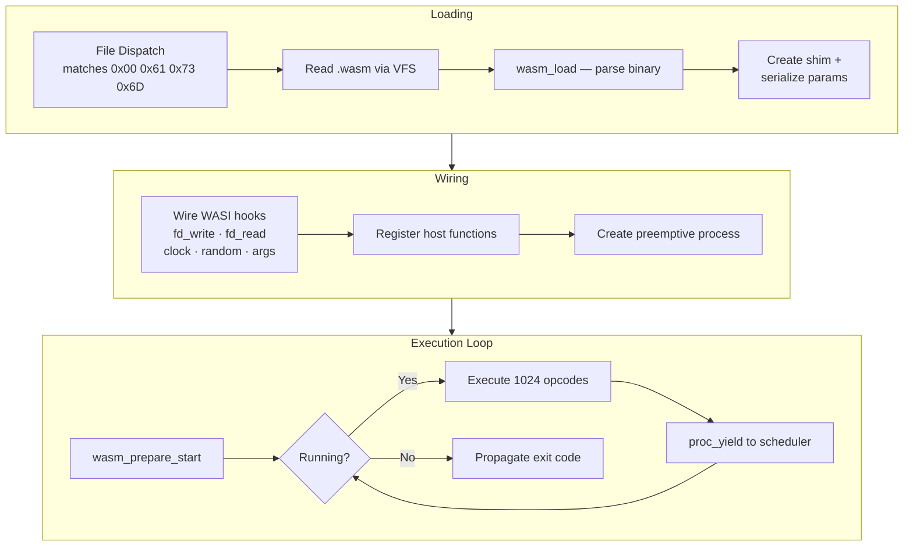

# Asuro OS Architecture

## System Overview

## Boot Sequence

## Memory Management

## Process Lifecycle

## Network Stack

## USB Stack

## Graphics Pipeline

## Terminal Command Flow

## WASM Execution

