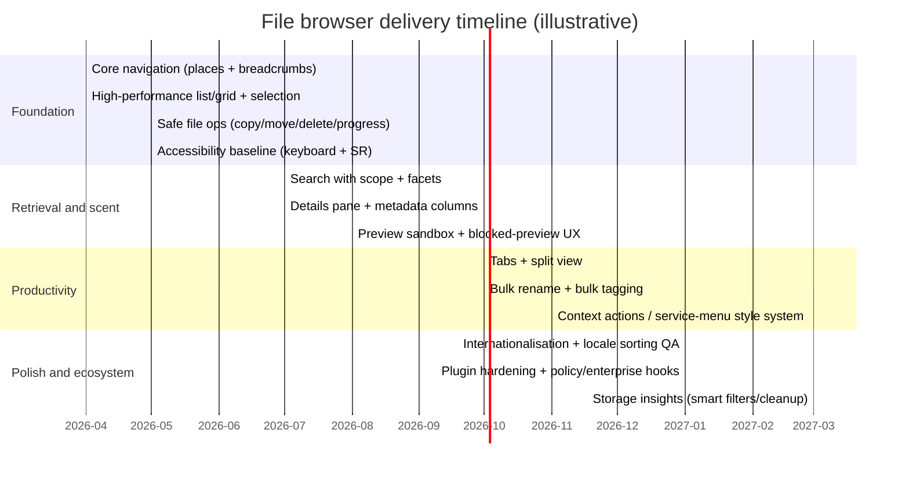

# File Browser Design for an Operating System

## Executive summary

This report synthesises evidence from human–file interaction and personal information management research, platform human‑interface guidelines, and high‑engagement user feedback to produce a rigorous, implementation‑aware design guide for an operating‑system file browser. The scope is broad by necessity: the user’s target OS (desktop vs mobile, single‑user vs managed enterprise, local‑first vs cloud‑first, filesystem semantics, device classes) is unspecified, so recommendations are framed as platform‑agnostic patterns with explicit default choices and trade‑offs. citeturn16search2turn21search14

Two empirical findings dominate the design implications:

First, navigation remains a primary retrieval strategy even when search improves. In a large study comparing “improved” desktop search engines, people still estimated they navigated for a majority of file retrieval events (roughly 56–68%) while using search for far fewer (roughly 4–15%), with search often used as a last resort when location isn’t remembered. citeturn9view2 This strongly supports “dual‑mode” file browser designs that treat browsing (hierarchies, places, breadcrumbs) as first‑class—not as a legacy mode to be replaced by search.

Second, folder structure has measurable impacts on retrieval time and success. In a large field study of personal file retrieval, “active files” were retrieved from relatively shallow depths (mean depth ≈ 2.86; most retrieved files at depth ≤ 4). Retrieval time was predicted by both depth and folder size (items per folder), with a regression model showing depth and folder size both significantly increase retrieval time. citeturn26view0turn26view2 This supports defaults and affordances that (a) keep deep navigation manageable (breadcrumbs, column view, history, “back/forward” semantics), (b) reduce per‑folder visual search costs (filtering within a folder, grouping, strong sorting), and (c) surface context and metadata so people can recognise the right target instead of recalling exact paths.

The report’s core recommendation is therefore a “recognition‑first, navigation‑plus‑search” model: preserve the user’s location context and information scent, enrich both browsing and search with metadata and previews, and provide low‑friction transitions between the two. A well‑designed file browser does not force a single mental model (pure hierarchy or pure tags), but instead offers layered retrieval cues: location, recency, type, people/time, tags/collections, and content search—each with predictable behaviour and clear scope. citeturn26view3turn26view4turn26view6

Three product risks repeatedly surface in industry behaviour and user feedback:

- **Performance and perceived latency**: File browsing is interaction‑dense (select, rename, open menu, preview, drag). Response time guidance suggests ~0.1s for “direct manipulation” feel, and longer tasks must be accompanied by clear progress/feedback. citeturn21search0turn21search3 Recent platform work (for example, background preloading of the file manager) highlights that teams will trade memory for launch‑time improvements; your design should anticipate and measure those trade‑offs rather than rely on “optimisation later.” citeturn21search14

- **Security vs convenience, especially previews and extensions**: For instance, Microsoft has disabled File Explorer preview by default for internet‑marked files (Mark of the Web) to mitigate credential‑leak vulnerabilities, forcing an explicit trust/unblock step. citeturn25search6turn22search32 A file browser must be designed so safe defaults remain usable: preview must degrade gracefully, actions must communicate why they are blocked, and extension points must be sandboxed and revocable.

- **Discoverability and workflow fit (tabs, split view, context actions)**: Users ask for “power” features (multi‑pane, per‑pane tabs, bulk rename, fast context actions) but become frustrated when controls are hidden behind modes or lack keyboard parity. Representative complaints include missing right‑click targets in dense list views, confusing tab hierarchies in split view, and “Quick Actions” that appear but do nothing. citeturn25search27turn25search3turn19search21

Deliverables in this report include:

- A detailed design guide: principles, navigation models, interaction patterns, UI components, and recommended defaults.
- A comparative table across major OS file managers and mobile file apps.
- A MoSCoW‑style prioritised feature list with rationale.
- Common pain points with direct quotes from social platforms.
- Suggested metrics, usability tests, and implementation trade‑offs (performance, privacy/security, extensibility, internationalisation).

## Evidence base and approach

The evidence base is triangulated from three categories:

Academic and standards research was used to anchor design choices in observed human behaviour rather than taste. Core inputs include (a) research on personal information management and personal file retrieval/search, which demonstrates persistent navigation preference and the measurable costs of folder depth and folder size; (b) work on information scent, emphasising that interfaces must provide cues that help people predict where relevant information or actions are located; and (c) established usability/performance guidance for response time and feedback. citeturn9view2turn26view2turn26view6turn21search0

Industry practice was used to catalogue proven patterns and the constraints that shaped them: preview panes and “Quick Actions” (macOS), extension models and security gating (Windows), sidebar and network‑mount models (GNOME), split view and contextual extensibility (KDE), and “smart filters/no‑more‑folders” approaches on mobile. citeturn19search5turn25search6turn19search38turn25search12turn4search11

Social‑platform feedback was used to capture recurring pain points, adoption barriers, and “sharp edges” that formal guidelines often miss. These sources are not treated as representative samples; instead, they help identify high‑salience issues that generate friction in real workflows (for example, context menu hit‑targets, split‑view tab semantics, missing details panes, or broken tagging/favourites). citeturn25search27turn25search3turn25search9turn4search28

The design guidance that follows assumes the file browser is a core OS shell component (long‑running, system‑integrated, expected to be stable, policy‑controlled in managed environments, and extensible). If your OS target differs (for example, kiosk, immutable OS, strict sandbox, or mobile‑only), treat the “recommended defaults” as a starting point and adjust the security and extensibility sections first.

Key “unspecified” elements that materially change decisions include: the OS platform class (desktop, tablet, phone), the filesystem and naming semantics, whether the system is cloud‑first, the permission model (POSIX vs capability‑based vs app sandbox), and whether the OS targets enterprise policy management. These are therefore called out explicitly where relevant.

## Design principles and navigation model

### Behavioural foundations to design for

A file browser must support two fundamentally different retrieval modes: **navigation/orienteering** (moving through familiar structure) and **search/filtering** (querying when structure fails). Research indicates users continue to prefer navigation even when search improves; search increases capability, but it does not “replace” hierarchical organisation in practice. citeturn9view2

Separately, folder structure is not arbitrary: people tend to keep active files in shallow hierarchies (depth around 3 on average), and both depth and per‑folder item count increase retrieval time in measurable ways. citeturn26view0turn26view2 The design goal is therefore not “eliminate folders,” but **reduce the cognitive and interaction cost per navigation step** and **make it easy to recover from being wrong**.

Finally, file collections at OS scale can be large: research on personal file collections reports structures that are much larger and deeper/wider than many UI prototypes assume (for example, tens to hundreds of thousands of files). citeturn16search2turn14search1 This drives performance and information architecture requirements: the UI cannot assume “small lists,” and metadata/indexing must be incremental and resilient.

### Information scent as a first‑class design target

Information scent refers to cues that help users judge where information or functionality is likely to be found. In practice, in desktop software scent comes from menu labels, icons, tooltips, previews, and history cues—not just from content. citeturn26view6 For file browsers, “scent” is primarily conveyed by:

- location cues (path, breadcrumbs, mounts, “where am I?”),
- semantic cues (file type, tags, ownership/sharing state),
- temporal cues (modified/created/opened),
- visual cues (thumbnails, previews, file‑type icons),
- behavioural cues (recents, pinned locations, history),
- action cues (context menu, quick actions, inline toolbars).

Design implication: **never show a list of files without *some* discriminating cues** where scale warrants it; and **prioritise cues users remember** (often “people” and “time” cues in personal information retrieval contexts). citeturn26view5

### Usability heuristics applied to file browsers

The most useful heuristic framing is to map classic UI heuristics onto file‑browser‑specific failure modes:

- **Visibility of system status**: file operations are often slow (copy, extract, index). Provide immediate feedback and unambiguous progress indicators; avoid “stall” ambiguity. citeturn21search3turn21search7

- **Match to the real world**: file metaphors (folders, drives, “locations”) must align with the OS permission model and storage reality (cloud placeholders, network mounts, external drives). Hiding this leads to “where did my file go?” moments.

- **User control and freedom**: undo/redo for destructive operations, recoverable delete (bin), and explicit conflict resolution are core. User feedback shows pain when systems remove or hide familiar affordances (for example, missing “details pane” capabilities or unexpected tab behaviour). citeturn25search9turn19search16

- **Consistency and standards**: selection behaviour, context menu semantics, and keyboard shortcuts must be consistent across views, panes, and tabs. HN feedback about context menus in list view highlights the cost of non‑standard pointer targets. citeturn25search27

- **Error prevention**: previewing untrusted content and executing downloaded apps are high‑risk zones. The UI must prevent accidental execution and communicate security state (quarantine/MotW) without obscuring normal workflows. citeturn25search6turn22search5

- **Recognition rather than recall**: integrate previews, metadata columns, and search facets so users can “spot” the target. This aligns with research on iterative, property‑based search and filtering for personal information. citeturn26view4turn26view5

- **Flexibility and efficiency for experts**: tabs, split view, keyboard‑first navigation, bulk rename, and extensibility are not optional in an OS file browser if you want power users to stay within the default tool. Persistent requests for per‑pane tabs in split view illustrate this. citeturn25search3turn19search31

### Navigation model recommendation

A robust OS file browser should support **four complementary navigation “modes” that share one internal state model**:

- **Places model**: stable top‑level entry points (Home, Documents, Downloads, mounted volumes, network locations, cloud roots). This is how users orient and can be configured/admin‑managed. citeturn19search12turn25search10turn19search38

- **Path model**: explicit location in a hierarchy (breadcrumbs/address bar, back/forward history, parent navigation). This supports the empirically strong navigation preference. citeturn9view2turn26view0

- **Collections model**: non‑hierarchical groupings (tags/labels, favourites/starred, saved searches). Mobile file apps foreground tags/favourites heavily, and breakage in these features causes significant workflow failure. citeturn4search12turn4search28

- **Query model**: search results as a first‑class “location,” with filters (type, date, tag, size), scoping (this folder vs everywhere), and stable re‑entry. Research suggests property‑based iterative refinement is key for finding personal information when recall is partial. citeturn26view4turn26view3

Crucially, transitions between these modes must be cheap and predictable: e.g., “filter within current folder” should share UI primitives with “search everywhere,” and search results should show enough location context to turn into navigation (open containing folder, show path, “go to”). citeturn26view4turn26view6

A concise interaction flow that captures these transitions is shown below.

```mermaid
flowchart TD
  A[User intent: find a file] --> B{Do they remember location?}
  B -- Yes --> C[Places/Sidebar entry or Recents/Favourites]
  C --> D[Browse hierarchy (breadcrumbs/column/tree)]
  D --> E{Recognise target?}
  E -- Yes --> F[Preview/Details -> Open or Action]
  E -- No --> G[In-folder filter (type/name/date)]
  G --> E

  B -- No/Unsure --> H[Search box]
  H --> I{Scope}
  I --> J[This folder]
  I --> K[Everywhere]
  J --> L[Facets/metadata filters]
  K --> L
  L --> M{Recognise target?}
  M -- Yes --> F
  M -- No --> N[Refine query / use suggested filters]
  N --> L

  F --> O[Optional: tag/favourite/save search]
  O --> P[Future retrieval faster]
```

## UI components, interaction patterns, and recommended defaults

### Comparative grounding from existing file managers

Before prescribing components, it is useful to note what major systems already converge on—because convergence often reflects both behavioural fit and implementation constraints.

image_group{"layout":"carousel","aspect_ratio":"16:9","query":["macOS Finder preview pane Quick Actions screenshot","Windows 11 File Explorer tabs preview pane screenshot","GNOME Files Nautilus sidebar Other Locations screenshot","KDE Dolphin split view tabs screenshot"],"num_per_query":1}

The table below summarises key patterns across major desktop and mobile file managers and defaults to “as documented” rather than “as perceived,” because user perceptions often reflect regressions or configuration differences. citeturn19search5turn25search10turn19search38turn25search12turn4search12turn4search11turn4search23

| System file manager | Primary navigation affordances | Tabs / multi‑pane | Preview model | Tags / favourites | Extensibility model | Notes relevant to design |
|---|---|---|---|---|---|---|
| macOS Finder | Sidebar “places”, multiple views; preview pane with metadata | Tabs supported (configurable) citeturn19search8turn19search4 | Preview pane + “Quick Actions” in Finder citeturn19search5turn19search1 | Finder tags supported citeturn3search0 | Quick Look / extensions (platform feature) citeturn3search3 | Strong “preview‑first” workflow; Quick Actions create an “action shelf” pattern in the preview area citeturn19search5 |
| Windows File Explorer | Sidebar + “File Explorer in Windows” shell integration (OneDrive, etc.) citeturn25search10 | Tabs exist in Windows 11 ecosystem; behaviour varies by build | Preview pane exists but has security gating; preview disabled by default for MotW files citeturn25search6turn25search13 | “Home/Quick access” style recency/pins exist (varies) | Shell extensions, preview handlers, etc. (high power, high risk) citeturn3search2 | Security and backwards‑compatibility pressures are explicit; preview is treated as an attack surface citeturn25search6 |
| GNOME Files (Nautilus) | Sidebar with “Other Locations”; network shares via GVFS URIs citeturn19search38 | Limited by design choices (varies by GNOME version) | Preview depends on shell; less centralised than Finder | “Recent/Starred” are present and debated citeturn25search4turn19search6 | Extensions exist but are more constrained | User feedback highlights sidebar clutter/customisation issues and “Recent” semantics confusion citeturn25search4turn25search7 |
| KDE Dolphin | Breadcrumb + editable path bar; tabs; split view; optional panels incl. terminal citeturn25search12 | Tabs + split windows (pane) supported citeturn25search12 | Info panel/preview options exist citeturn25search12 | Bookmarks; comments/metadata panels (varies) | Service menus for context actions; user‑creatable citeturn19search31 | Strong “power user” bias; community requests focus on per‑pane tabs and UI hierarchy clarity citeturn25search3turn25search1 |
| iOS Files app | Browse view with locations; Recents; sidebar on iPad citeturn4search12turn4search9 | Multiwindow limited; iPad supports split app workflows | Previews in OS; tags/favourites are key retrieval routes | Tags + favourites supported citeturn4search12 | Provider extensions for cloud storage (platform concept) | User impact is high when tags/favourites/recents fail, because they are primary navigation substitutes for path depth citeturn4search28 |
| Files by Google | “Smart filters” and categories emphasised (“No more folders” framing) citeturn4search11 | Mobile‑standard (no desktop‑style panes) | Media playback + file actions | App and OS integration; secure folder features mentioned | Limited; depends on Android platform | Explicitly positions filters and offline sharing as first‑class user needs citeturn4search8turn4search11 |
| Samsung My Files | Category‑based access + storage/cloud access citeturn4search23turn4search15 | Mobile‑standard | Basic preview/open‑in‑app | Categories act as semantic retrieval | Limited | Highlights the mobile pattern: categories and storage views often replace deep navigation citeturn4search23 |

### Core UI components

#### Window and layout anatomy

A desktop‑class file browser typically benefits from a 3‑region structure:

- A **navigation/header area** (toolbar, address/breadcrumbs, search).
- A **context/places sidebar** (locations, mounts, favourites, tags, saved searches).
- A **content/results area** (list/grid/columns/gallery) with optional **details/preview pane**.

This structure is reinforced by platform guidance and real products: Finder’s preview pane explicitly contains “metadata” and “Quick Actions,” demonstrating the value of a persistent “information + actions” region that updates as selection changes. citeturn19search5turn19search1

Recommended defaults (desktop):

- **Show a breadcrumb path bar by default** with a one‑click switch to an editable path field (“type a path”)—a pattern Dolphin explicitly supports (“breadcrumb” plus editable navigation bar). citeturn25search12
- **Expose search in the chrome** (top bar) rather than only via a menu item; treat search as a peer to navigation, not a hidden “power” function. citeturn26view4
- **Provide a details/preview pane toggle** and remember per‑view or per‑folder state, because different tasks require different information density, and persistent state reduces configuration labour. Finder and Dolphin both treat panels as integral but optional. citeturn19search5turn25search12

Recommended defaults (mobile/tablet):

- Prioritise **Browse + Recents + Search + Tags/Favourites** as top‑level “routes,” because deep path traversal by touch is expensive and error‑prone; iOS’s Files app guidance foregrounds tagging and favourites within the Browse experience. citeturn4search12turn4search9

#### Selection model and bulk operations

The selection model must be consistent across views and input modalities:

- pointer selection (single, multi, range),
- keyboard navigation and selection,
- assistive technology navigation/selection,
- touch selection and multi‑select gestures.

This is not only an accessibility requirement; it is a core productivity requirement. The design implication of the folder‑size effect is that as per‑folder item counts grow, selection becomes a visual search problem and must be assisted by sorting/grouping and type‑ahead filtering. citeturn26view1turn26view2

Recommended defaults:

- **Type‑ahead selection in lists** (start typing to jump).
- **In‑folder filter** (quick filter box) distinct from full‑text search, because filtering within a large folder directly reduces the folder‑size cost observed in retrieval time. citeturn26view2
- **Batch rename** as a first‑class tool (not a plugin‑only feature), because renaming is a common “maintenance” action and users actively seek better integration. KDE’s service menu ecosystem and forum discussions illustrate that users will install add‑ons purely to make bulk rename convenient. citeturn19search31turn19search7

#### Contextual actions and command surfaces

Modern file browsers generally need three action surfaces, each serving different discovery/proficiency levels:

- **Context menu** (right‑click / long‑press): high discoverability for “what can I do to this item?”
- **Inline affordances** (toolbar buttons, “Quick Actions” shelf): lower latency for common actions.
- **Command palette / search‑actions** (optional): expert speed and “search for commands.”

A recurring failure mode is that context menus become unreliable due to hit‑target or empty‑space requirements; a Hacker News comment describes being unable to right‑click in list view to paste/create because dense lists leave no empty area. citeturn25search27 This is a design smell: context menus must be triggerable reliably (e.g., on the background *and* on the container area, not only on “empty pixels”).

Recommended defaults:

- Context menu triggers should work on:
  - the selection (item context),
  - the container (folder context),
  - the background (view context),
  without requiring special empty areas.

- Prefer “progressive disclosure” in the context menu: show the 6–10 most common actions, group rarer actions under “More…”. Microsoft’s evolving context menus and third‑party attempts to improve them indicate that clutter and inconsistency is a real pain point. citeturn25news37turn21news38

#### Preview / Quick Look and security‑aware degradation

Preview is simultaneously (a) one of the biggest productivity multipliers and (b) a security attack surface (parsers, renderers, ActiveX‑era extension models, embedded external fetches). This is not hypothetical: Microsoft disabled preview functionality by default for files tagged with Mark of the Web specifically to mitigate credential leakage risks from previewing content that references external paths. citeturn25search6turn22search32

Design requirements that fall out of this:

- The UI must display **security state** for the selected file (downloaded/untrusted, signed/unsigned, quarantined, origin) in a non‑alarmist way.
- When preview is blocked, provide:
  - a clear explanation (“Preview disabled for untrusted files”),
  - a safe alternative path (“Open in sandboxed viewer” where possible),
  - an explicit trust action (unblock) that is auditable and reversible.

By contrast, Finder strongly encourages preview via a preview pane that includes both a visual preview and “a comprehensive list of all the metadata,” plus “Quick Actions” that operate without opening a separate app. citeturn19search5turn19search1 This demonstrates a powerful pattern: the preview surface can also be the “metadata scent” surface.

Recommended defaults:

- Desktop: preview pane **off by default** for conservative/security‑first OS targets; **on by default** for consumer OS targets where preview is a core workflow (as long as preview is sandboxed and respects trust state). The appropriate default is OS‑strategy dependent (unspecified here). citeturn25search6turn19search5
- Mobile: preview is typically the primary “open” path; emphasise safety by restricting executable behaviours and showing origin state.

#### Tabs, windows, and split views

Tabs and multi‑pane workflows are a major differentiator between “casual” and “power” file managers.

Finder supports opening folders in tabs vs windows based on settings and modifiers, demonstrating that even mainstream systems require configurability because “tab‑first” and “window‑first” users both exist. citeturn19search8turn19search4 Dolphin explicitly supports both tabbed browsing and split windows, adding optional panels (folders tree, terminal) for navigation and operations. citeturn25search12

User feedback indicates split view semantics can become confusing if the “tab model” is global rather than per‑pane: a Reddit comment asks for “separate per‑pane tabs” and claims other file managers “do it the right way.” citeturn25search3 Even if you disagree with the claim, it signals a real mental‑model mismatch: users conceptualise each pane as a quasi‑independent workspace.

Recommended defaults:

- Support **tabs** and **split view** on desktop.
- Tabs should be **per window**, but split view should allow either:
  - per‑pane tab sets (preferred for clarity), or
  - a clear visual model for shared tabs (if chosen), with explicit cues about which pane a tab affects. citeturn25search3turn25search1

#### Tags/labels and “collections” navigation

Tags are a cross‑platform pattern: Finder supports tagging files and folders, and iOS Files supports tagging items and browsing tagged items in the sidebar. citeturn3search0turn4search12 Mobile systems further demonstrate that tags/favourites are not “nice to have”; users treat them as primary retrieval routes, and when they break, workflows collapse. citeturn4search28

Design principle: implement tags as **views/collections** rather than as “metadata only,” and ensure tags are:

- visible in lists (as badges or a column),
- filterable and searchable,
- assignable in bulk,
- synchronised where cloud providers exist.

Recommended defaults:

- Provide a small set of default tags (Work, Personal, Important) and allow user‑defined tags.
- Make tagging available in the main action surfaces (context menu + details pane).
- Provide a “tag shelf” in the sidebar for quick access, but allow hiding/customisation because some users see sidebars as clutter (GNOME “Recent/Starred/Home” debates reinforce this). citeturn25search7turn19search6

### Metadata, search, and visual hierarchy

#### Search as iterative refinement, not one‑shot query

A key design implication from personal information retrieval research is that queries are short and often followed by iterative refinement using filters, sorting, and grouping; the UI should couple keyword search with property browsing. citeturn26view4turn26view3

Recommended search UI patterns:

- One search box, two scopes: **“Search in this folder”** and **“Search everywhere.”**
- Facets for common properties:
  - type/kind,
  - modified date ranges,
  - size buckets,
  - tags,
  - (where relevant) people/owners/sharing state. citeturn26view5turn25search10
- Results should show:
  - file name with highlighting,
  - path (“where”), because navigation remains preferred and users often want to “go to” the file’s home,
  - key metadata columns.

#### Visual hierarchy choices

The file browser must continuously answer four questions without overwhelming the user:

1. Where am I? (location)
2. What am I looking at? (collection/selection)
3. What can I do? (actions)
4. What is happening? (system status)

Visual hierarchy tactics that consistently improve these:

- persistent breadcrumbs with current segment emphasis,
- a stable sidebar with clear grouping (Devices, Locations, Tags, Shared),
- a selection summary in the status bar,
- a details/preview pane that is explicitly “about the selection.”

Finder’s preview pane design and Dolphin’s optional info panel embody this: selection drives the right‑hand “facts” region. citeturn19search5turn25search12

### Iconography and affordances

Iconography should be consistent with the platform’s visual language and scale well. GNOME’s HIG prescribes “symbolic” (monochrome, 16×16 SVG‑based) UI icons for clarity at small sizes. citeturn24search2 Windows design guidance describes iconography as a system of metaphors and distinguishes icon types (application, system, file type). citeturn24search5 Apple’s guidance emphasises use of SF Symbols for consistent action iconography across Apple platforms. citeturn24search0turn24search4

Design recommendations:

- Use **symbolic/action icons** for toolbars/menus (themeable, high contrast friendly).
- Reserve **file‑type icons** and **thumbnails** for content differentiation; ensure graceful fallbacks.
- Avoid conveying critical state by colour alone; use shape/iconography + text. This aligns with inclusive design expectations across platforms. citeturn20search5turn20search0

### Accessibility and inputs: keyboard, screen readers, gestures

Accessibility must be designed in, not patched:

- Windows accessibility guidance stresses designing a logical hierarchy with keyboard focus and standard controls. citeturn20search5turn20search9
- Apple HIG accessibility highlights VoiceOver as a primary modality. citeturn20search0turn20search8
- GNOME’s Orca screen reader relies on AT‑SPI infrastructure; applications must expose accessibility semantics through the toolkit. citeturn20search2turn20search14

File‑browser‑specific a11y requirements:

- All views must be operable without pointer input:
  - navigate items,
  - multi‑select,
  - open context menu,
  - rename,
  - drag‑equivalent operations (copy/move via commands).
- Focus must be visible and stable; list/grid views must announce selection counts and item metadata.
- Keyboard shortcuts must be discoverable (tooltips, menus, and help), and documented for assistive tech. citeturn20search17turn20search8

Recommended default shortcuts (desktop):

- Open/search: platform standard (e.g., Win+E style entry points are expected in Windows environments). citeturn25search10
- Toggle preview/details pane.
- Toggle split view.
- Open new tab.
- Rename, delete, copy, move.
- Focus search box.
- “Reveal in folder” / “Go to containing folder” for search results.

Gestures (touch and trackpad):

- Rubber‑band multi‑select.
- Two‑finger swipe back/forward (history).
- Drag‑and‑drop with spring‑loaded folders (hover‑open), but provide keyboard alternatives.

### Internationalisation and sorting

Internationalisation is not only about text translation; file browsing depends on collation, case handling, and filename normalisation.

- The Unicode Collation Algorithm (UTS #10) specifies how to compare Unicode strings and supports tailoring for language expectations. citeturn23search0
- ICU collation documentation emphasises locale‑appropriate ordering and warns that default ordering will not match expectations for many languages without locale tailoring. citeturn23search1turn23search5
- Apple’s APFS guide notes that APFS preserves filename normalisation and uses hashes of the normalised form to provide normalisation insensitivity, and that low‑level directory enumeration can return filenames in hash order rather than lexicographic order. citeturn23search6
- Windows documentation highlights that naming conventions differ across filesystems (NTFS, exFAT, etc.), implying a file browser must handle differing constraints. citeturn23search7

Design requirements:

- Sorting must be **locale‑aware**, stable, and predictable.
- Provide “natural sort” options (numbers in names) and document behaviour.
- Always display exact filenames, but compare/sort using appropriate collation rules.
- Respect filesystem constraints and expose errors clearly (invalid characters, length limits), with localisation.

## Prioritised feature list with rationale

The prioritisation below assumes a desktop‑class OS file browser with a companion mobile/tablet variant. Where a feature’s priority materially depends on OS strategy (enterprise vs consumer, cloud‑first vs local‑first), it is noted as **strategy‑dependent (unspecified)**.

### MoSCoW matrix

| Priority | Feature | Rationale grounded in evidence |
|---|---|---|
| **Must** | Dual navigation + search model (places, breadcrumbs, search with scope) | Navigation remains dominant even with improved search; users need both. citeturn9view2turn26view0 |
| **Must** | High‑performance list/grid rendering, incremental loading, responsive selection feedback | File browsing is interaction‑dense; 0.1s feedback threshold for “direct manipulation” feel; show loaders for multi‑second operations. citeturn21search0turn21search3 |
| **Must** | Safe file operations: copy/move/delete with progress, cancellation, and recoverable delete | Visibility of status and safe recovery are core to trust; OS file browsers are expected to manage long operations. citeturn21search7turn21search3 |
| **Must** | Security‑aware preview and origin signalling (downloaded/untrusted), with graceful fallback when preview is blocked | Preview is an attack surface; Windows disables preview for MotW by default; design must keep workflow usable. citeturn25search6turn22search2turn22search32 |
| **Must** | Accessibility baseline: keyboard operability, focus visibility, screen reader semantics | Platform design guidance requires this; OS shell components set the accessibility bar. citeturn20search5turn20search0turn20search2 |
| **Must** | Core metadata display (size, type, modified) + “more details” view | Users rely on metadata to discriminate; removal/regression creates friction (“more work for us users”). citeturn25search9turn19search5 |
| **Should** | Tabs and split view (dual pane) on desktop | Strong productivity benefit; widespread expectation; user feedback highlights desire for better split‑view tab semantics. citeturn19search8turn25search12turn25search3 |
| **Should** | In‑folder filter (quick filter) distinct from full search | Folder size increases retrieval time; in‑folder filtering reduces visual search cost. citeturn26view1turn26view2 |
| **Should** | Preview pane with action shelf (a “Quick Actions” pattern) | Finder demonstrates a combined metadata + actions region; reduces app switching for common tasks. citeturn19search5turn19search1 |
| **Should** | Tagging/labels + favourites as first‑class navigation collections | Cross‑platform adoption; workflows break when tags/favourites fail; mobile relies heavily on them. citeturn3search0turn4search12turn4search28 |
| **Should** | Extensibility constrained by safety: context actions/service menus, preview plugins sandboxed | KDE service menus show demand for user‑addable actions; but Windows preview/security history demands constraints. citeturn19search31turn25search6 |
| **Should** | Network and cloud locations treated as standard “places,” with clear authentication state | GNOME’s “Other Locations” + GVFS URIs show a pattern; poor discovery causes support burden. citeturn19search38turn19search2 |
| **Could** | Semantic “smart filters” (media, large files, duplicates) | Mobile file managers position this as primary value; useful for cleanup and casual users. citeturn4search11turn4search8 |
| **Could** | Activity‑oriented views (Recent, “by project”) with user control to hide | GNOME sidebar debates show “Recent/Starred” can be clutter; must be customizable. citeturn25search7turn25search4 |
| **Could** | Advanced visualisations (treemap/storage map) as optional tool | Useful for storage management, but not core to browsing; keep out of default chrome unless OS targets storage triage. citeturn14search2turn4search11 |
| **Could** | Background preloading to reduce cold‑start latency (desktop) | Industry shows willingness to trade memory for launch speed; should be controlled and measured. citeturn21search14 |
| **Won’t (by default)** | Always‑on “search everywhere” that hides location | Conflicts with persistent navigation preference and known folder‑structure behaviours; should remain available, not mandatory. citeturn9view2turn26view0 |
| **Won’t (unless strategy demands)** | Unrestricted third‑party shell extensions running in‑process | High stability and security risk; preview is already treated as a vulnerability surface. citeturn25search6turn3search2 |

## Common user pain points with representative quotes

The quotes below are selected to be representative of recurring issues, not to claim statistical prevalence.

### Context actions and hit‑targets

A Hacker News user described an interaction failure in list view: being unable to right‑click to paste or create because the UI only accepts right‑click on empty area, which disappears when the list fills the viewport. citeturn25search27

> “...in list view... it only accepts a right click in an empty area... as soon as you have a few files... you’re given no empty area to click in.” citeturn25search27

Design implication: “background context menu” must work even in dense lists; “empty pixel” requirements are brittle.

### Split view and tab mental models

A KDE user explicitly requests per‑pane tabs in split view:

> “Yes, there shoud be separate tabs for each pane...” citeturn25search3

Another KDE discussion frames this as a hierarchy mismatch where the “location” part of the toolbar belongs to the current tab, and the mismatch becomes more visible in split views. citeturn25search1

Design implication: multi‑pane + tabs needs a crisp state model and visual affordances indicating which pane a navigation/action affects.

### Metadata visibility regressions

A Microsoft Answers thread shows user frustration when “details pane” workflows degrade:

> “...my only work around is... ‘properties’... ‘details’ tab... Just more work for us users.” citeturn25search9

Design implication: metadata must remain cheap to access, and bulk metadata inspection should not require modal dialogues.

### Preview/action feature fragility

An Apple Support Community user reports “Quick Actions” present but non‑functional:

> “When I hover over or click any of these items, NOTHING HAPPENS!” citeturn19search21

Other Apple community threads report Quick Actions not appearing even when enabled. citeturn19search29

Design implication: if the UI advertises inline actions, their reliability must be extremely high; otherwise they erode trust in the entire selection/preview surface.

### Tag and favourites reliability on mobile

An iPadOS user reports favourites and tags as primary organisation tools, and describes a severe breakdown when they disappear or stop showing files:

> “...I no longer see any of my Favorites... when I select [tags], no files appear... This is a big issue...” citeturn4search28

Design implication: if the system treats tags/favourites/recents as primary retrieval surfaces (common on mobile), their data integrity and sync correctness become “core reliability,” not “nice to have.”

### Sidebar clutter and customisation pressure

GNOME users discuss removing “Recent/Starred/Home” entries or note that their experience “broke” due to the semantics of a “Recent folder/list” that behaves unlike a folder in deletion expectations. citeturn25search7turn25search4

Design implication: provide sidebar customisation and ensure “virtual views” (Recent, Starred) clearly communicate different semantics from real folders (e.g., clearing history vs deleting files).

## Recommended metrics and usability tests

### Product metrics aligned to behavioural evidence

Because folder depth and folder size measurably affect retrieval time, instrument your file browser to quantify the “real cost” of your navigation UI and discover regressions early. citeturn26view2turn26view0

Recommended behavioural metrics (desktop):

- **Retrieval success rate**: proportion of “find file X” tasks completed without assistance.
- **Time‑to‑first‑correct‑candidate**: time until the target is first highlighted/previewed (recognition milestone).
- **Depth traversed and mis‑navigation count**: number of folder transitions, backtracks, and wrong‑folder entries per retrieval.
- **Folder size at selection**: items visible in the final folder; correlate with selection time to detect UI scaling issues (reflecting the observed folder size effect). citeturn26view1turn26view2
- **Search usage patterns**: query count, query length, refinement actions (filter/sort/group). Short queries with iterative refinement should be supported, not punished. citeturn26view4turn26view3
- **Preview usage and “blocked preview” rate**: how often users attempt preview; how often preview is blocked due to trust state; subsequent actions (open anyway, unblock, abandon). This is critical where preview security gating exists (MotW/quarantine). citeturn25search6turn22search32

Performance metrics:

- **Input‑to‑feedback latency** for selection highlight, context menu open, rename initiation.
- **Cold start time** and **warm start time**, including potential preloading trade‑offs. citeturn21search14
- **Thumbnail/preview time** for large folders; include p95/p99, not only mean.

Accessibility metrics:

- **Keyboard‑only task completion** (same tasks as mouse users).
- **Screen reader traversal time** and “verbosity correctness” (does the system announce item name, type, selection count?).
- **Focus loss rate** (unexpected focus jumps after operations).

Internationalisation metrics:

- **Locale‑correct sorting acceptance rate** in markets with non‑Latin scripts.
- **Filename edge case handling** (normalisation, diacritics, bidi text, emoji) given OS/filesystem differences. citeturn23search0turn23search6turn23search7

### Usability tests that reliably surface file‑browser flaws

A strong test suite should combine controlled tasks (comparable metrics) with “messy reality” tasks (ecological validity):

Controlled retrieval tasks (lab/remote moderated):

- **Known‑location retrieval**: “Find the PDF you saved in your ‘Taxes’ folder last month.” Measure navigation time, depth, errors.
- **Vague‑attribute retrieval**: “Find the photo from your trip; you remember it was taken at night and edited.” This directly probes metadata filtering and preview. citeturn26view5turn19search5
- **Cross‑source retrieval** (cloud + local + external drive): evaluates “places model” clarity and storage state signalling. citeturn25search10turn4search12
- **Bulk operation tasks**: rename 50 files, tag a set, move between panes, resolve duplicates.

Exploratory/diary‑style studies:

- Have participants log “couldn’t find it” moments for 1–2 weeks, capturing:
  - what they remembered (name? type? time? person? location?),
  - what path they tried (browse vs search),
  - where they failed.
This aligns with the “people/time/metadata cues” motivations documented in personal search research. citeturn26view5turn26view3

Security usability tests:

- Preview a MotW/quarantined file, observe whether users understand the “blocked preview” state and whether the unblock path is comprehensible. citeturn25search6turn22search32

## Implementation considerations and trade‑offs

### Performance engineering as a UX requirement

Response time limits and loading guidance imply a requirement, not a suggestion: actions like selection, expanding tree nodes, opening context menus, and switching tabs should feel immediate; longer tasks require progress indicators and must remain cancellable. citeturn21search0turn21search3turn21search7

A concrete industry example is Microsoft exploring background preloading of File Explorer to improve perceived launch time. This “trade memory for speed” strategy must be evaluated against device classes, energy use, and privacy constraints. citeturn21search14

Trade‑off checklist:

- Preloading improves cold start but consumes RAM and may affect low‑memory devices.
- Thumbnail generation can be done lazily, but must not “flash” layouts; consider placeholder stability.
- Indexing/search improves retrieval but consumes CPU/I/O and may reveal content; gating and scheduling matter.

### Privacy and security

File browsers bridge untrusted content and high‑privilege operations. Two platform mechanisms illustrate why this matters:

- Microsoft Defender SmartScreen is explicitly designed to protect against malicious downloads and apps. citeturn22search2
- Mark of the Web (MotW) tags downloaded files with origin metadata (Zone.Identifier), and Microsoft has introduced or adjusted behaviour (preview disabled by default) to mitigate credential leakage from previews. citeturn25search6turn22search32
- Apple’s Gatekeeper is designed to ensure only trusted software runs, with explicit warnings about overriding protections. citeturn22search5turn22search31

Design patterns to balance security and usability:

- **Trust state as metadata**: show origin and trust state in the details pane and tooltips; make it auditably changeable (unblock).
- **Principled preview sandboxing**: run preview renderers out‑of‑process with restricted network access; treat preview as “view” not “execute.”
- **Extension containment**: third‑party context actions and previews should be permissioned, rate‑limited, and uninstallable without destabilising the shell.

### Extensibility vs stability

KDE’s service menus demonstrate high user value from configurable context actions that are not full plugins; they can give power without deep integration cost. citeturn19search31 But Windows history shows that in‑process shell extensions and preview handlers can become stability and security liabilities, and modern mitigations can reduce capability (for example, blocked previews for MotW). citeturn25search6turn3search2

A pragmatic approach:

- Provide **tiered extensibility**:
  - “safe actions” (commands executed with explicit user invocation, limited context),
  - “unsafe integrations” (preview renderers, thumbnails) requiring stronger sandboxing and code signing.

### Internationalisation and filesystem semantics

Locale‑aware sorting and filename normalisation differences can cause surprising bugs and perceived “missing files.” The Unicode Collation Algorithm and ICU tailoring provide a principled base for sorting in the UI. citeturn23search0turn23search1 At the filesystem layer, APFS behaviour differs from HFS+ in how names are stored and returned by low‑level enumeration, meaning the file browser should not assume lexicographic directory order. citeturn23search6 Windows filesystems impose differing naming rules, so a cross‑filesystem file browser must validate and communicate errors appropriately. citeturn23search7

### Suggested delivery timeline

A staged timeline helps avoid shipping an unusable “MVP” that lacks the features users consider table stakes (search, preview safety, bulk ops). The timeline below is a generic suggestion; adjust based on OS strategy (unspecified).



## Source and platform references used

The report draws on: peer‑reviewed and open academic work on personal search/navigation and folder structure; official platform guidance from major OS vendors; and high‑engagement user discussions on entity["company","Reddit","social news platform"], entity["organization","Hacker News","tech news site"], and entity["company","Stack Overflow","developer q&a site"]. citeturn9view2turn26view2turn25search27turn22search26 Platform guidance referenced includes materials from entity["company","Apple","consumer tech company"] and entity["company","Microsoft","software company"], as well as official guidance from the GNOME and KDE ecosystems (for example, GNOME icon guidelines and KDE service menus). citeturn24search2turn19search31turn19search5turn25search10 The internationalisation guidance references standards from the entity["organization","Unicode Consortium","unicode standards body"]. citeturn23search0turn23search1